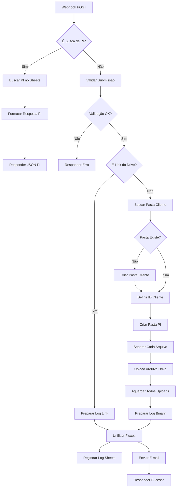

# Documentação Técnica do Workflow n8n

## 📋 Índice

- [Visão Geral](#visão-geral)
- [Arquitetura do Workflow](#arquitetura-do-workflow)
- [Fluxo Detalhado](#fluxo-detalhado)
- [Documentação dos Nós](#documentação-dos-nós)
- [Códigos JavaScript](#códigos-javascript)
- [Tratamento de Erros](#tratamento-de-erros)
- [Otimizações e Performance](#otimizações-e-performance)
- [Manutenção e Monitoramento](#manutenção-e-monitoramento)

## Visão Geral

O workflow n8n do formulário de checking processa duas operações principais através de um único webhook:

1. **Busca de PI:** Consulta dados da planilha para auto-preenchimento
2. **Submissão de Checking:** Valida, organiza no Drive e notifica

### Especificações Técnicas

| Item | Valor |
|------|-------|
| **Webhook URL** | `https://n8n.grupoom.com.br/webhook/CheckingForm` |
| **Método HTTP** | POST |
| **Timeout** | 3600s (60 minutos) |
| **Max Payload** | 800MB |
| **Total de Nós** | 19 nós |
| **Execuções Paralelas** | Suportado |

## Arquitetura do Workflow

### Diagrama Visual



### Estrutura de Dados

#### Entrada - Busca de PI
```json
{
  "action": "buscar_pi",
  "n_pi": "182429"
}
```

#### Entrada - Submissão
```json
{
  "action": "submissao_form",
  "nome": "string",
  "email": "string",
  "telefone": "string",
  "n_pi": "string",
  "cliente": "string",
  "campanha": "string",
  "produto": "string",
  "periodo": "string",
  "veiculo": "string",
  "meio": "string",
  "observacoes": "string",
  "upload_method": "binary",
  "relatorio_fotografico_do": "File[]",
  // ... outros arquivos
}
```

## Fluxo Detalhado

### 1️⃣ Rota de Busca de PI

#### Nó 1: Webhook POST
**Tipo:** `n8n-nodes-base.webhook`
**Configuração:**
```yaml
httpMethod: POST
path: CheckingForm
responseMode: responseNode
webhookId: checking-form-post
```

**Descrição:** Recebe todas as requisições POST. O corpo da requisição é disponibilizado em `$json.body`.

---

#### Nó 2: É Busca de PI?
**Tipo:** `n8n-nodes-base.if`
**Condição:**
```javascript
$json.body.action === "buscar_pi"
```

**Descrição:** Roteia para busca se `action` for `"buscar_pi"`, caso contrário vai para submissão.

---

#### Nó 3: Buscar PI no Sheets
**Tipo:** `n8n-nodes-base.googleSheets`
**Operação:** Read
**Configuração:**
```yaml
documentId: "1iwUay2RE8k1PumivMbEjuzIyw4CBaktJ2YPsR1iwe_Q"
sheetName: "gid=0"  # Aba principal
filtersUI:
  - lookupColumn: "N_PI"
    lookupValue: "={{ $json.body.n_pi }}"
```

**Descrição:** Busca linha onde coluna `N_PI` corresponde ao número fornecido.

**Saída Esperada:**
```json
[
  {
    "N_PI": "182429",
    "CLIENTE": "NOME CLIENTE",
    "CAMPANHA": "CAMPANHA",
    "PRODUTO": "PRODUTO",
    "PERIODO": "01/01/2025 - 31/01/2025",
    "VEICULO": "VEICULO",
    "MEIO": "DO",
    "STATUS": "ativa"
  }
]
```

---

#### Nó 4: Formatar Resposta PI
**Tipo:** `n8n-nodes-base.code`
**Código:**
```javascript
const items = $input.all();

if (items.length === 0 || !items[0].json.N_PI) {
  return [{ 
    json: { 
      success: false, 
      error: 'PI não encontrada' 
    } 
  }];
}

const pi = items[0].json;

return [{
  json: {
    success: true,
    cliente: pi.CLIENTE || '',
    campanha: pi.CAMPANHA || '',
    produto: pi.PRODUTO || '',
    periodo: pi.PERIODO || '',
    veiculo: pi.VEICULO || '',
    meio: pi.MEIO || ''
  }
}];
```

**Descrição:** Transforma dados do Sheets em resposta JSON padronizada.

---

#### Nó 5: Responder JSON PI
**Tipo:** `n8n-nodes-base.respondToWebhook`
**Configuração:**
```yaml
respondWith: json
responseBody: "={{ $json }}"
```

**Descrição:** Envia resposta de volta ao formulário.

---

### 2️⃣ Rota de Submissão

#### Nó 6: Validar Submissão
**Tipo:** `n8n-nodes-base.code`
**Código Completo:**
```javascript
const item = $input.item;
const body = item.json.body || {};
const binary = item.binary || {};
const erros = [];

// 1. Validar campos obrigatórios
const camposObrigatorios = ['nome', 'email', 'telefone', 'n_pi'];
const camposFaltando = camposObrigatorios.filter(
  campo => !body[campo] || body[campo].trim() === ''
);

if (camposFaltando.length > 0) {
  erros.push(`Campos obrigatórios faltando: ${camposFaltando.join(', ')}`);
}

// 2. Verificar método de upload
const uploadMethod = body.upload_method;
const driveLink = body.drive_link;

if (uploadMethod === 'drive_link') {
  // Validar link do Drive
  if (!driveLink || !driveLink.includes('drive.google.com')) {
    erros.push('Link do Google Drive inválido.');
  } else {
    const matchFolder = driveLink.match(/folders\/([a-zA-Z0-9_-]+)/);
    const matchFile = driveLink.match(/[-\w]{25,}/);
    
    if (matchFolder) {
      item.json.driveFolderId = matchFolder[1];
      item.json.uploadMethod = 'drive_link';
    } else if (matchFile) {
      item.json.driveFolderId = matchFile[0];
      item.json.uploadMethod = 'drive_link';
    } else {
      erros.push('Não foi possível extrair o ID do link do Drive.');
    }
  }
} else {
  // Validar anexos binários
  item.json.uploadMethod = 'binary';
  const meio = body.meio;
  
  const anexosRequeridosPorMeio = {
    'DO': ['relatorio_fotografico_do', 'relatorio_exibicoes_do', 'video_diurno_do'],
    'ME': ['relatorio_enderecos_me', 'fotos_pontos_me'],
    'MO': ['relatorio_estacoes_mo', 'fotos_videos_mo'],
    'BD': ['comprovante_bd'],
    'OD': ['comprovante_od_fl'],
    'FL': ['comprovante_od_fl'],
    'MI': ['comprovante_mi'],
    'AT': ['comprovante_geral'],
    'CI': ['comprovante_geral'],
    'IN': ['comprovante_geral'],
    'JO': ['comprovante_geral'],
    'RD': ['comprovante_geral'],
    'RV': ['comprovante_geral'],
    'TV': ['comprovante_geral'],
    'TP': ['comprovante_geral']
  };

  const camposAnexoRequeridos = anexosRequeridosPorMeio[meio];

  if (!meio) {
    erros.push('Campo Meio não preenchido.');
  } else if (!camposAnexoRequeridos) {
    erros.push(`Meio '${meio}' não possui regras de anexo definidas.`);
  } else {
    const anexosFaltando = [];
    
    camposAnexoRequeridos.forEach(campo => {
      const temArquivo = Object.keys(binary).some(key => {
        return key === campo || key.startsWith(campo + '_');
      });
      
      if (!temArquivo) {
        anexosFaltando.push(campo);
      }
    });
    
    if (anexosFaltando.length > 0) {
      erros.push(`Anexos obrigatórios faltando: ${anexosFaltando.join(', ')}`);
    }
  }
}

item.json.validationResult = erros.length > 0
  ? { success: false, message: erros.join('; ') }
  : { success: true, message: 'Validação concluída.' };

return [item];
```

**Descrição:** Validação completa de campos e arquivos. Suporta dois métodos de upload:
- **binary:** Arquivos anexados diretamente (< 500MB)
- **drive_link:** Link para pasta do Drive já criada (≥ 500MB)

---

#### Nó 7: Validação OK?
**Tipo:** `n8n-nodes-base.if`
**Condição:**
```javascript
Boolean($json.validationResult?.success) === true
```

**Descrição:** Verifica se não houve erros na validação. Caso contrário, retorna erro 400.

---

#### Nó 8: Responder Erro
**Tipo:** `n8n-nodes-base.respondToWebhook`
**Configuração:**
```yaml
respondWith: json
responseBody: "={{ { \"success\": false, \"message\": $json.validationResult.message || \"Erro na validação.\" } }}"
options:
  responseCode: 400
```

**Descrição:** Retorna mensagem de erro detalhada ao front-end.

---

#### Nó 9: É Link do Drive?
**Tipo:** `n8n-nodes-base.if`
**Condição:**
```javascript
$json.uploadMethod === "drive_link"
```

**Descrição:** Separa fluxo para uploads via link (≥500MB) vs binários (<500MB).

---

### 3️⃣ Rota: Link do Drive (≥500MB)

#### Nó 10: Preparar Log Link
**Tipo:** `n8n-nodes-base.code`
**Código:**
```javascript
const submissionData = $items('Validar Submissão')[0].json;
const body = submissionData.body;

return [{
  json: {
    n_pi: body.n_pi || 'N/A',
    cliente: body.cliente || 'N/A',
    veiculo: body.veiculo || 'N/A',
    nome: body.nome || 'N/A',
    email: body.email || 'N/A',
    telefone: body.telefone || 'N/A',
    meio: body.meio || 'N/A',
    observacoes: body.observacoes || '',
    totalArquivos: 'Via Link Drive',
    uploadMethod: 'drive_link',
    webViewLink: body.drive_link || 'Link não fornecido'
  }
}];
```

**Descrição:** Prepara dados para log quando usuário fornece link do Drive.

---

### 4️⃣ Rota: Upload Binário (<500MB)

#### Nó 11: Buscar Pasta Cliente
**Tipo:** `n8n-nodes-base.googleDrive`
**Operação:** Search
**Configuração:**
```yaml
searchMethod: query
queryString: "={{ \"name='\" + $items('Validar Submissão')[0].json.body.cliente.trim().toUpperCase() + \"' and mimeType='application/vnd.google-apps.folder' and '1OEL4MtYKd5Tg-ZOmsIRG9RQkvfX-xs_s' in parents and trashed=false\" }}"
```

**Descrição:** Busca pasta do cliente dentro da pasta raiz "Checkings". O ID `1OEL4MtYKd5Tg-ZOmsIRG9RQkvfX-xs_s` é a pasta raiz.

**Query traduzida:**
```
name='NOME_CLIENTE' 
and mimeType='application/vnd.google-apps.folder' 
and '1OEL4MtYKd5Tg-ZOmsIRG9RQkvfX-xs_s' in parents 
and trashed=false
```

---

#### Nó 12: Pasta Cliente Existe?
**Tipo:** `n8n-nodes-base.if`
**Condição:**
```javascript
$json.id != null
```

**Descrição:** Verifica se a busca retornou uma pasta. Se não, cria nova pasta.

---

#### Nó 13: Criar Pasta Cliente
**Tipo:** `n8n-nodes-base.googleDrive`
**Operação:** Create Folder
**Configuração:**
```yaml
name: "={{ $items('Validar Submissão')[0].json.body.cliente.toUpperCase() }}"
folderId: "1OEL4MtYKd5Tg-ZOmsIRG9RQkvfX-xs_s"  # Pasta raiz Checkings
```

**Descrição:** Cria pasta com nome do cliente em UPPERCASE dentro da pasta raiz.

---

#### Nó 14: Definir ID da Pasta Cliente
**Tipo:** `n8n-nodes-base.set`
**Configuração:**
```yaml
assignments:
  - name: clientFolderId
    value: "={{ $json.id }}"
    type: string
```

**Descrição:** Captura o ID da pasta (encontrada ou criada) para usar na próxima etapa.

---

#### Nó 15: Criar Pasta PI
**Tipo:** `n8n-nodes-base.googleDrive`
**Operação:** Create Folder
**Configuração:**
```yaml
name: "={{ 'PI ' + $items('Validar Submissão')[0].json.body.n_pi + ' - ' + $items('Validar Submissão')[0].json.body.cliente.replace(/[\/\\?%*:|\"<>]/g, '-') + ' - ' + $now.toFormat(\"dd-MM-yyyy HH'h'mm\") }}"
folderId: "={{ $json.clientFolderId }}"
```

**Exemplo de nome gerado:**
```
PI 182429 - CLIENTE XYZ - 15-10-2025 14h30
```

**Descrição:** Cria pasta específica da PI dentro da pasta do cliente, com timestamp.

---

#### Nó 16: Separar Cada Arquivo
**Tipo:** `n8n-nodes-base.code`
**Código:**
```javascript
const submissionItem = $items('Validar Submissão')[0];
const piFolderId = $json.id;

const binary = submissionItem.binary || {};
const arquivos = [];

let totalArquivos = 0;

for (const key in binary) {
  totalArquivos++;
  arquivos.push({
    json: {
      ...submissionItem.json,
      piFolderId: piFolderId,
      nomeArquivoOriginal: binary[key].fileName || `arquivo_${totalArquivos}`,
      mimeType: binary[key].mimeType || 'application/octet-stream',
      totalArquivos: 0
    },
    binary: {
      data: binary[key]
    }
  });
}

// Atualizar total em todos os itens
arquivos.forEach(item => {
  item.json.totalArquivos = totalArquivos;
});

return arquivos.length > 0 ? arquivos : [{ json: { erro: 'Nenhum arquivo encontrado' } }];
```

**Descrição:** Converte objeto com múltiplos arquivos binários em array de itens individuais para upload paralelo.

**Entrada:**
```javascript
{
  binary: {
    relatorio_fotografico_do: File1,
    relatorio_exibicoes_do: File2,
    video_diurno_do: File3
  }
}
```

**Saída:**
```javascript
[
  { json: {...}, binary: { data: File1 } },
  { json: {...}, binary: { data: File2 } },
  { json: {...}, binary: { data: File3 } }
]
```

---

#### Nó 17: Upload Arquivo no Drive
**Tipo:** `n8n-nodes-base.googleDrive`
**Operação:** Upload
**Configuração:**
```yaml
folderId: "={{ $json.piFolderId }}"
```

**Descrição:** Faz upload de cada arquivo individualmente na pasta da PI. Executa em paralelo para todos os arquivos.

---

#### Nó 18: Aguardar Todos Uploads
**Tipo:** `n8n-nodes-base.merge`
**Modo:** Combine All
**Configuração:**
```yaml
mode: combine
combineBy: combineAll
```

**Descrição:** Aguarda conclusão de todos os uploads paralelos antes de prosseguir.

---

#### Nó 19: Preparar Log Binary
**Tipo:** `n8n-nodes-base.code`
**Código:**
```javascript
const todosUploads = $input.all();
const submissionData = $items('Validar Submissão')[0].json.body;
const pastaPi = $items('Criar Pasta PI')[0].json;

return [{
  json: {
    n_pi: submissionData.n_pi || 'N/A',
    cliente: submissionData.cliente || 'N/A',
    veiculo: submissionData.veiculo || 'N/A',
    nome: submissionData.nome || 'N/A',
    email: submissionData.email || 'N/A',
    telefone: submissionData.telefone || 'N/A',
    meio: submissionData.meio || 'N/A',
    observacoes: submissionData.observacoes || '',
    totalArquivos: todosUploads.length,
    uploadMethod: 'binary',
    webViewLink: pastaPi.webViewLink || 'https://drive.google.com/drive/folders/' + pastaPi.id
  }
}];
```

**Descrição:** Consolida informações de todos os uploads em um único objeto para log.

---

### 5️⃣ Unificação e Finalização

#### Nó 20: Unificar Fluxos
**Tipo:** `n8n-nodes-base.merge`
**Descrição:** Une os dados vindos do fluxo de link e do fluxo binário em um único fluxo.

---

#### Nó 21: Registrar Log no Sheets
**Tipo:** `n8n-nodes-base.googleSheets`
**Operação:** Append
**Configuração:**
```yaml
documentId: "1iwUay2RE8k1PumivMbEjuzIyw4CBaktJ2YPsR1iwe_
