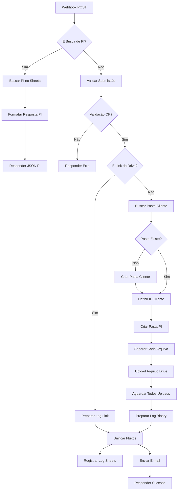

# Documentação Técnica do Workflow n8n

## 📋 Índice

- [Visão Geral](#visão-geral)
- [Arquitetura do Workflow](#arquitetura-do-workflow)
- [Fluxo Detalhado](#fluxo-detalhado)
- [Documentação dos Nós](#documentação-dos-nós)
- [Códigos JavaScript](#códigos-javascript)
- [Tratamento de Erros](#tratamento-de-erros)
- [Otimizações e Performance](#otimizações-e-performance)
- [Manutenção e Monitoramento](#manutenção-e-monitoramento)

## Visão Geral

O workflow n8n do formulário de checking processa duas operações principais através de um único webhook:

1. **Busca de PI:** Consulta dados da planilha para auto-preenchimento
2. **Submissão de Checking:** Valida, organiza no Drive e notifica

### Especificações Técnicas

| Item | Valor |
|------|-------|
| **Webhook URL** | `https://n8n.grupoom.com.br/webhook/CheckingForm` |
| **Método HTTP** | POST |
| **Timeout** | 3600s (60 minutos) |
| **Max Payload** | 800MB |
| **Total de Nós** | 19 nós |
| **Execuções Paralelas** | Suportado |

## Arquitetura do Workflow

### Diagrama Visual



### Estrutura de Dados

#### Entrada - Busca de PI
```json
{
  "action": "buscar_pi",
  "n_pi": "182429"
}
```

#### Entrada - Submissão
```json
{
  "action": "submissao_form",
  "nome": "string",
  "email": "string",
  "telefone": "string",
  "n_pi": "string",
  "cliente": "string",
  "campanha": "string",
  "produto": "string",
  "periodo": "string",
  "veiculo": "string",
  "meio": "string",
  "observacoes": "string",
  "upload_method": "binary",
  "relatorio_fotografico_do": "File[]",
  // ... outros arquivos
}
```

## Fluxo Detalhado

### 1️⃣ Rota de Busca de PI

#### Nó 1: Webhook POST
**Tipo:** `n8n-nodes-base.webhook`
**Configuração:**
```yaml
httpMethod: POST
path: CheckingForm
responseMode: responseNode
webhookId: checking-form-post
```

**Descrição:** Recebe todas as requisições POST. O corpo da requisição é disponibilizado em `$json.body`.

---

#### Nó 2: É Busca de PI?
**Tipo:** `n8n-nodes-base.if`
**Condição:**
```javascript
$json.body.action === "buscar_pi"
```

**Descrição:** Roteia para busca se `action` for `"buscar_pi"`, caso contrário vai para submissão.

---

#### Nó 3: Buscar PI no Sheets
**Tipo:** `n8n-nodes-base.googleSheets`
**Operação:** Read
**Configuração:**
```yaml
documentId: "1iwUay2RE8k1PumivMbEjuzIyw4CBaktJ2YPsR1iwe_Q"
sheetName: "gid=0"  # Aba principal
filtersUI:
  - lookupColumn: "N_PI"
    lookupValue: "={{ $json.body.n_pi }}"
```

**Descrição:** Busca linha onde coluna `N_PI` corresponde ao número fornecido.

**Saída Esperada:**
```json
[
  {
    "N_PI": "182429",
    "CLIENTE": "NOME CLIENTE",
    "CAMPANHA": "CAMPANHA",
    "PRODUTO": "PRODUTO",
    "PERIODO": "01/01/2025 - 31/01/2025",
    "VEICULO": "VEICULO",
    "MEIO": "DO",
    "STATUS": "ativa"
  }
]
```

---

#### Nó 4: Formatar Resposta PI
**Tipo:** `n8n-nodes-base.code`
**Código:**
```javascript
const items = $input.all();

if (items.length === 0 || !items[0].json.N_PI) {
  return [{ 
    json: { 
      success: false, 
      error: 'PI não encontrada' 
    } 
  }];
}

const pi = items[0].json;

return [{
  json: {
    success: true,
    cliente: pi.CLIENTE || '',
    campanha: pi.CAMPANHA || '',
    produto: pi.PRODUTO || '',
    periodo: pi.PERIODO || '',
    veiculo: pi.VEICULO || '',
    meio: pi.MEIO || ''
  }
}];
```

**Descrição:** Transforma dados do Sheets em resposta JSON padronizada.

---

#### Nó 5: Responder JSON PI
**Tipo:** `n8n-nodes-base.respondToWebhook`
**Configuração:**
```yaml
respondWith: json
responseBody: "={{ $json }}"
```

**Descrição:** Envia resposta de volta ao formulário.

---

### 2️⃣ Rota de Submissão

#### Nó 6: Validar Submissão
**Tipo:** `n8n-nodes-base.code`
**Código Completo:**
```javascript
const item = $input.item;
const body = item.json.body || {};
const binary = item.binary || {};
const erros = [];

// 1. Validar campos obrigatórios
const camposObrigatorios = ['nome', 'email', 'telefone', 'n_pi'];
const camposFaltando = camposObrigatorios.filter(
  campo => !body[campo] || body[campo].trim() === ''
);

if (camposFaltando.length > 0) {
  erros.push(`Campos obrigatórios faltando: ${camposFaltando.join(', ')}`);
}

// 2. Verificar método de upload
const uploadMethod = body.upload_method;
const driveLink = body.drive_link;

if (uploadMethod === 'drive_link') {
  // Validar link do Drive
  if (!driveLink || !driveLink.includes('drive.google.com')) {
    erros.push('Link do Google Drive inválido.');
  } else {
    const matchFolder = driveLink.match(/folders\/([a-zA-Z0-9_-]+)/);
    const matchFile = driveLink.match(/[-\w]{25,}/);
    
    if (matchFolder) {
      item.json.driveFolderId = matchFolder[1];
      item.json.uploadMethod = 'drive_link';
    } else if (matchFile) {
      item.json.driveFolderId = matchFile[0];
      item.json.uploadMethod = 'drive_link';
    } else {
      erros.push('Não foi possível extrair o ID do link do Drive.');
    }
  }
} else {
  // Validar anexos binários
  item.json.uploadMethod = 'binary';
  const meio = body.meio;
  
  const anexosRequeridosPorMeio = {
    'DO': ['relatorio_fotografico_do', 'relatorio_exibicoes_do', 'video_diurno_do'],
    'ME': ['relatorio_enderecos_me', 'fotos_pontos_me'],
    'MO': ['relatorio_estacoes_mo', 'fotos_videos_mo'],
    'BD': ['comprovante_bd'],
    'OD': ['comprovante_od_fl'],
    'FL': ['comprovante_od_fl'],
    'MI': ['comprovante_mi'],
    'AT': ['comprovante_geral'],
    'CI': ['comprovante_geral'],
    'IN': ['comprovante_geral'],
    'JO': ['comprovante_geral'],
    'RD': ['comprovante_geral'],
    'RV': ['comprovante_geral'],
    'TV': ['comprovante_geral'],
    'TP': ['comprovante_geral']
  };

  const camposAnexoRequeridos = anexosRequeridosPorMeio[meio];

  if (!meio) {
    erros.push('Campo Meio não preenchido.');
  } else if (!camposAnexoRequeridos) {
    erros.push(`Meio '${meio}' não possui regras de anexo definidas.`);
  } else {
    const anexosFaltando = [];
    
    camposAnexoRequeridos.forEach(campo => {
      const temArquivo = Object.keys(binary).some(key => {
        return key === campo || key.startsWith(campo + '_');
      });
      
      if (!temArquivo) {
        anexosFaltando.push(campo);
      }
    });
    
    if (anexosFaltando.length > 0) {
      erros.push(`Anexos obrigatórios faltando: ${anexosFaltando.join(', ')}`);
    }
  }
}

item.json.validationResult = erros.length > 0
  ? { success: false, message: erros.join('; ') }
  : { success: true, message: 'Validação concluída.' };

return [item];
```

**Descrição:** Validação completa de campos e arquivos. Suporta dois métodos de upload:
- **binary:** Arquivos anexados diretamente (< 500MB)
- **drive_link:** Link para pasta do Drive já criada (≥ 500MB)

---

#### Nó 7: Validação OK?
**Tipo:** `n8n-nodes-base.if`
**Condição:**
```javascript
Boolean($json.validationResult?.success) === true
```

**Descrição:** Verifica se não houve erros na validação. Caso contrário, retorna erro 400.

---

#### Nó 8: Responder Erro
**Tipo:** `n8n-nodes-base.respondToWebhook`
**Configuração:**
```yaml
respondWith: json
responseBody: "={{ { \"success\": false, \"message\": $json.validationResult.message || \"Erro na validação.\" } }}"
options:
  responseCode: 400
```

**Descrição:** Retorna mensagem de erro detalhada ao front-end.

---

#### Nó 9: É Link do Drive?
**Tipo:** `n8n-nodes-base.if`
**Condição:**
```javascript
$json.uploadMethod === "drive_link"
```

**Descrição:** Separa fluxo para uploads via link (≥500MB) vs binários (<500MB).

---

### 3️⃣ Rota: Link do Drive (≥500MB)

#### Nó 10: Preparar Log Link
**Tipo:** `n8n-nodes-base.code`
**Código:**
```javascript
const submissionData = $items('Validar Submissão')[0].json;
const body = submissionData.body;

return [{
  json: {
    n_pi: body.n_pi || 'N/A',
    cliente: body.cliente || 'N/A',
    veiculo: body.veiculo || 'N/A',
    nome: body.nome || 'N/A',
    email: body.email || 'N/A',
    telefone: body.telefone || 'N/A',
    meio: body.meio || 'N/A',
    observacoes: body.observacoes || '',
    totalArquivos: 'Via Link Drive',
    uploadMethod: 'drive_link',
    webViewLink: body.drive_link || 'Link não fornecido'
  }
}];
```

**Descrição:** Prepara dados para log quando usuário fornece link do Drive.

---

### 4️⃣ Rota: Upload Binário (<500MB)

#### Nó 11: Buscar Pasta Cliente
**Tipo:** `n8n-nodes-base.googleDrive`
**Operação:** Search
**Configuração:**
```yaml
searchMethod: query
queryString: "={{ \"name='\" + $items('Validar Submissão')[0].json.body.cliente.trim().toUpperCase() + \"' and mimeType='application/vnd.google-apps.folder' and '1OEL4MtYKd5Tg-ZOmsIRG9RQkvfX-xs_s' in parents and trashed=false\" }}"
```

**Descrição:** Busca pasta do cliente dentro da pasta raiz "Checkings". O ID `1OEL4MtYKd5Tg-ZOmsIRG9RQkvfX-xs_s` é a pasta raiz.

**Query traduzida:**
```
name='NOME_CLIENTE' 
and mimeType='application/vnd.google-apps.folder' 
and '1OEL4MtYKd5Tg-ZOmsIRG9RQkvfX-xs_s' in parents 
and trashed=false
```

---

#### Nó 12: Pasta Cliente Existe?
**Tipo:** `n8n-nodes-base.if`
**Condição:**
```javascript
$json.id != null
```

**Descrição:** Verifica se a busca retornou uma pasta. Se não, cria nova pasta.

---

#### Nó 13: Criar Pasta Cliente
**Tipo:** `n8n-nodes-base.googleDrive`
**Operação:** Create Folder
**Configuração:**
```yaml
name: "={{ $items('Validar Submissão')[0].json.body.cliente.toUpperCase() }}"
folderId: "1OEL4MtYKd5Tg-ZOmsIRG9RQkvfX-xs_s"  # Pasta raiz Checkings
```

**Descrição:** Cria pasta com nome do cliente em UPPERCASE dentro da pasta raiz.

---

#### Nó 14: Definir ID da Pasta Cliente
**Tipo:** `n8n-nodes-base.set`
**Configuração:**
```yaml
assignments:
  - name: clientFolderId
    value: "={{ $json.id }}"
    type: string
```

**Descrição:** Captura o ID da pasta (encontrada ou criada) para usar na próxima etapa.

---

#### Nó 15: Criar Pasta PI
**Tipo:** `n8n-nodes-base.googleDrive`
**Operação:** Create Folder
**Configuração:**
```yaml
name: "={{ 'PI ' + $items('Validar Submissão')[0].json.body.n_pi + ' - ' + $items('Validar Submissão')[0].json.body.cliente.replace(/[\/\\?%*:|\"<>]/g, '-') + ' - ' + $now.toFormat(\"dd-MM-yyyy HH'h'mm\") }}"
folderId: "={{ $json.clientFolderId }}"
```

**Exemplo de nome gerado:**
```
PI 182429 - CLIENTE XYZ - 15-10-2025 14h30
```

**Descrição:** Cria pasta específica da PI dentro da pasta do cliente, com timestamp.

---

#### Nó 16: Separar Cada Arquivo
**Tipo:** `n8n-nodes-base.code`
**Código:**
```javascript
const submissionItem = $items('Validar Submissão')[0];
const piFolderId = $json.id;

const binary = submissionItem.binary || {};
const arquivos = [];

let totalArquivos = 0;

for (const key in binary) {
  totalArquivos++;
  arquivos.push({
    json: {
      ...submissionItem.json,
      piFolderId: piFolderId,
      nomeArquivoOriginal: binary[key].fileName || `arquivo_${totalArquivos}`,
      mimeType: binary[key].mimeType || 'application/octet-stream',
      totalArquivos: 0
    },
    binary: {
      data: binary[key]
    }
  });
}

// Atualizar total em todos os itens
arquivos.forEach(item => {
  item.json.totalArquivos = totalArquivos;
});

return arquivos.length > 0 ? arquivos : [{ json: { erro: 'Nenhum arquivo encontrado' } }];
```

**Descrição:** Converte objeto com múltiplos arquivos binários em array de itens individuais para upload paralelo.

**Entrada:**
```javascript
{
  binary: {
    relatorio_fotografico_do: File1,
    relatorio_exibicoes_do: File2,
    video_diurno_do: File3
  }
}
```

**Saída:**
```javascript
[
  { json: {...}, binary: { data: File1 } },
  { json: {...}, binary: { data: File2 } },
  { json: {...}, binary: { data: File3 } }
]
```

---

#### Nó 17: Upload Arquivo no Drive
**Tipo:** `n8n-nodes-base.googleDrive`
**Operação:** Upload
**Configuração:**
```yaml
folderId: "={{ $json.piFolderId }}"
```

**Descrição:** Faz upload de cada arquivo individualmente na pasta da PI. Executa em paralelo para todos os arquivos.

---

#### Nó 18: Aguardar Todos Uploads
**Tipo:** `n8n-nodes-base.merge`
**Modo:** Combine All
**Configuração:**
```yaml
mode: combine
combineBy: combineAll
```

**Descrição:** Aguarda conclusão de todos os uploads paralelos antes de prosseguir.

---

#### Nó 19: Preparar Log Binary
**Tipo:** `n8n-nodes-base.code`
**Código:**
```javascript
const todosUploads = $input.all();
const submissionData = $items('Validar Submissão')[0].json.body;
const pastaPi = $items('Criar Pasta PI')[0].json;

return [{
  json: {
    n_pi: submissionData.n_pi || 'N/A',
    cliente: submissionData.cliente || 'N/A',
    veiculo: submissionData.veiculo || 'N/A',
    nome: submissionData.nome || 'N/A',
    email: submissionData.email || 'N/A',
    telefone: submissionData.telefone || 'N/A',
    meio: submissionData.meio || 'N/A',
    observacoes: submissionData.observacoes || '',
    totalArquivos: todosUploads.length,
    uploadMethod: 'binary',
    webViewLink: pastaPi.webViewLink || 'https://drive.google.com/drive/folders/' + pastaPi.id
  }
}];
```

**Descrição:** Consolida informações de todos os uploads em um único objeto para log.

---

### 5️⃣ Unificação e Finalização

#### Nó 20: Unificar Fluxos
**Tipo:** `n8n-nodes-base.merge`
**Descrição:** Une os dados vindos do fluxo de link e do fluxo binário em um único fluxo.

---

#### Nó 21: Registrar Log no Sheets
**Tipo:** `n8n-nodes-base.googleSheets`
**Operação:** Append
**Configuração:**
```yaml
documentId: "1iwUay2RE8k1PumivMbEjuzIyw4CBaktJ2YPsR1iwe_Q"
sheetName: 1807228652  # Log_Checkings
columns:
  PI: "={{ $json.n_pi }}"
  Veículo: "={{ $json.veiculo }}"
  Cliente: "={{ $json.cliente }}"
  Data: "={{ $now.toFormat('dd/MM/yyyy HH:mm:ss') }}"
  Qtd_Arquivos: "={{ $json.totalArquivos }}"
  Status: "Enviado"
```

**Descrição:** Adiciona nova linha na aba "Log_Checkings" com todos os detalhes da submissão.

---

#### Nó 22: Enviar E-mail Notificação
**Tipo:** `n8n-nodes-base.emailSend`
**Configuração:**
```yaml
fromEmail: "marleneg@opusmultipla.com.br"
toEmail: "marleneg@opusmultipla.com.br"
subject: "=Novo Checking Recebido - PI {{ $json.n_pi }}"
html: "=<!DOCTYPE html>...</html>"  # Template HTML completo
```

**Template de E-mail:** Ver seção [Template HTML](#template-html-do-e-mail) abaixo.

**Descrição:** Envia notificação formatada com todos os detalhes do checking.

---

#### Nó 23: Responder Sucesso
**Tipo:** `n8n-nodes-base.respondToWebhook`
**Configuração:**
```yaml
respondWith: json
responseBody: |
  {
    "success": true,
    "message": "Checking enviado com sucesso!"
  }
```

**Descrição:** Retorna confirmação de sucesso ao front-end.

---

## Códigos JavaScript

### Validação de Anexos por Meio

```javascript
// Mapeamento completo de anexos obrigatórios por meio
const anexosRequeridosPorMeio = {
  'DO': [
    'relatorio_fotografico_do',
    'relatorio_exibicoes_do',
    'video_diurno_do'
  ],
  'ME': [
    'relatorio_enderecos_me',
    'fotos_pontos_me'
  ],
  'MO': [
    'relatorio_estacoes_mo',
    'fotos_videos_mo'
  ],
  'BD': ['comprovante_bd'],
  'OD': ['comprovante_od_fl'],
  'FL': ['comprovante_od_fl'],
  'MI': ['comprovante_mi'],
  'AT': ['comprovante_geral'],
  'CI': ['comprovante_geral'],
  'IN': ['comprovante_geral'],
  'JO': ['comprovante_geral'],
  'RD': ['comprovante_geral'],
  'RV': ['comprovante_geral'],
  'TV': ['comprovante_geral'],
  'TP': ['comprovante_geral']
};

// Validação
const meio = body.meio;
const camposRequeridos = anexosRequeridosPorMeio[meio];

if (!camposRequeridos) {
  throw new Error(`Meio '${meio}' não configurado`);
}

const anexosFaltando = [];

camposRequeridos.forEach(campo => {
  const temArquivo = Object.keys(binary).some(key => {
    return key === campo || key.startsWith(campo + '_');
  });
  
  if (!temArquivo) {
    anexosFaltando.push(campo);
  }
});

if (anexosFaltando.length > 0) {
  throw new Error(`Anexos faltando: ${anexosFaltando.join(', ')}`);
}
```

### Extração de ID do Google Drive

```javascript
// Suporta múltiplos formatos de URL
function extrairDriveId(url) {
  // Formato: https://drive.google.com/drive/folders/FOLDER_ID
  const matchFolder = url.match(/folders\/([a-zA-Z0-9_-]+)/);
  if (matchFolder) return matchFolder[1];
  
  // Formato: https://drive.google.com/file/d/FILE_ID
  const matchFile = url.match(/\/d\/([a-zA-Z0-9_-]+)/);
  if (matchFile) return matchFile[1];
  
  // Formato: ID direto (25+ caracteres alfanuméricos)
  const matchDirect = url.match(/[-\w]{25,}/);
  if (matchDirect) return matchDirect[0];
  
  return null;
}

const driveId = extrairDriveId(body.drive_link);
if (!driveId) {
  throw new Error('Não foi possível extrair ID do Drive');
}
```

### Formatação de Nome de Pasta

```javascript
// Remove caracteres inválidos para nomes de arquivo/pasta
function sanitizarNome(nome) {
  return nome.replace(/[\/\\?%*:|\"<>]/g, '-');
}

// Gera nome padronizado
const nomePasta = [
  'PI',
  n_pi,
  '-',
  sanitizarNome(cliente),
  '-',
  $now.toFormat("dd-MM-yyyy HH'h'mm")
].join(' ');

// Resultado: "PI 182429 - CLIENTE XYZ - 15-10-2025 14h30"
```

---

## Template HTML do E-mail

```html
<!DOCTYPE html>
<html lang="pt-BR">
<head>
    <meta charset="UTF-8">
    <meta name="viewport" content="width=device-width, initial-scale=1.0">
    <link href="https://fonts.googleapis.com/css2?family=Inter:wght@300;400;500;600;700;800;900&display=swap" rel="stylesheet">
    <title>Notificação de Checking</title>
</head>
<body style="margin: 0; padding: 0; font-family: 'Inter', sans-serif; background-color: #f7fafc;">
    <table width="100%" border="0" cellspacing="0" cellpadding="0">
        <tr>
            <td align="center" style="padding: 20px;">
                <table width="650" border="0" cellspacing="0" cellpadding="0" style="background: #ffffff; border-radius: 8px;">
                    
                    <!-- Barra colorida superior -->
                    <tr>
                        <td height="4" style="background: linear-gradient(90deg, #ef4444 0%, #f59e0b 20%, #10b981 40%, #3b82f6 60%, #8b5cf6 80%, #ec4899 100%);"></td>
                    </tr>
                    
                    <!-- Cabeçalho -->
                    <tr>
                        <td align="center" style="padding: 40px; border-bottom: 1px solid #e2e8f0;">
                            <h1 style="font-size: 28px; font-weight: 800; color: #2d3748; margin: 0; text-transform: uppercase; letter-spacing: 2px;">
                                Novo Checking Recebido
                            </h1>
                            <p style="font-size: 16px; color: #4a5568; margin: 15px 0 0 0;">
                                Um novo comprovante foi submetido com sucesso.
                            </p>
                        </td>
                    </tr>
                    
                    <!-- Conteúdo -->
                    <tr>
                        <td style="padding: 40px;">
                            <table width="100%" border="0" cellspacing="0" cellpadding="0">
                                <!-- Cliente e PI -->
                                <tr>
                                    <td width="50%" style="padding-right: 15px; padding-bottom: 30px;">
                                        <p style="font-size: 12px; color: #4a5568; margin: 0 0 8px 0; font-weight: 600; text-transform: uppercase;">
                                            Cliente
                                        </p>
                                        <p style="font-size: 18px; color: #2d3748; margin: 0; font-weight: 500;">
                                            {{ $json.cliente }}
                                        </p>
                                    </td>
                                    <td width="50%" style="padding-left: 15px; padding-bottom: 30px;">
                                        <p style="font-size: 12px; color: #4a5568; margin: 0 0 8px 0; font-weight: 600; text-transform: uppercase;">
                                            Nº da PI
                                        </p>
                                        <p style="font-size: 18px; color: #2d3748; margin: 0; font-weight: 500;">
                                            {{ $json.n_pi }}
                                        </p>
                                    </td>
                                </tr>
                                
                                <!-- Veículo e Data -->
                                <tr>
                                    <td width="50%" style="padding-right: 15px; padding-bottom: 30px;">
                                        <p style="font-size: 12px; color: #4a5568; margin: 0 0 8px 0; font-weight: 600; text-transform: uppercase;">
                                            Veículo
                                        </p>
                                        <p style="font-size: 18px; color: #2d3748; margin: 0; font-weight: 500;">
                                            {{ $json.veiculo }}
                                        </p>
                                    </td>
                                    <td width="50%" style="padding-left: 15px; padding-bottom: 30px;">
                                        <p style="font-size: 12px; color: #4a5568; margin: 0 0 8px 0; font-weight: 600; text-transform: uppercase;">
                                            Data/Hora do Envio
                                        </p>
                                        <p style="font-size: 18px; color: #2d3748; margin: 0; font-weight: 500;">
                                            {{ $now.toFormat('dd/MM/yyyy HH:mm:ss') }}
                                        </p>
                                    </td>
                                </tr>
                                
                                <!-- Enviado por -->
                                <tr>
                                    <td colspan="2" style="padding-bottom: 30px;">
                                        <p style="font-size: 12px; color: #4a5568; margin: 0 0 8px 0; font-weight: 600; text-transform: uppercase;">
                                            Enviado por
                                        </p>
                                        <p style="font-size: 18px; color: #2d3748; margin: 0; font-weight: 500;">
                                            {{ $json.nome }}
                                        </p>
                                        <p style="font-size: 16px; color: #4a5568; margin: 5px 0 0 0;">
                                            {{ $json.email }}
                                        </p>
                                    </td>
                                </tr>
                                
                                <!-- Observações -->
                                <tr>
                                    <td colspan="2">
                                        <p style="font-size: 12px; color: #4a5568; margin: 0 0 8px 0; font-weight: 600; text-transform: uppercase;">
                                            Observações
                                        </p>
                                        <p style="font-size: 16px; color: #2d3748; margin: 0; background: #f7fafc; padding: 20px; border-radius: 4px; border: 1px solid #e2e8f0;">
                                            {{ $json.observacoes || 'Nenhuma observação foi fornecida.' }}
                                        </p>
                                    </td>
                                </tr>
                            </table>
                        </td>
                    </tr>
                    
                    <!-- Botão -->
                    <tr>
                        <td align="center" style="padding: 0 40px 40px 40px;">
                            <a href="{{ $json.webViewLink }}" 
                               target="_blank" 
                               style="background: #0033a0; color: #ffffff; padding: 16px 40px; text-decoration: none; border-radius: 4px; font-size: 15px; font-weight: 700; display: inline-block; text-transform: uppercase; letter-spacing: 0.5px;">
                                Acessar Arquivos no Drive
                            </a>
                        </td>
                    </tr>

                    <!-- Barra colorida inferior -->
                    <tr>
                        <td height="4" style="background: linear-gradient(90deg, #ef4444 0%, #f59e0b 20%, #10b981 40%, #3b82f6 60%, #8b5cf6 80%, #ec4899 100%);"></td>
                    </tr>

                    <!-- Rodapé -->
                    <tr>
                        <td align="center" style="padding: 40px; background: #e5e7eb;">
                            <p style="font-size: 32px; font-weight: 800; color: #2d3748; margin: 0; letter-spacing: 3px;">
                                GRUPO OM
                            </p>
                            <p style="font-size: 11px; color: #4a5568; margin: 8px 0 0 0; letter-spacing: 4px; text-transform: uppercase; font-weight: 600;">
                                Comunicação Integrada
                            </p>
                        </td>
                    </tr>
                </table>
            </td>
        </tr>
    </table>
</body>
</html>
```

---

## Tratamento de Erros

### Estratégias Implementadas

#### 1. Validação em Múltiplas Camadas

```javascript
// Camada 1: Front-end (JavaScript)
if (!form.checkValidity()) {
  showError('Preencha todos os campos obrigatórios');
  return;
}

// Camada 2: Webhook (n8n Code)
if (camposFaltando.length > 0) {
  return { 
    success: false, 
    message: `Campos faltando: ${camposFaltando.join(', ')}` 
  };
}

// Camada 3: APIs externas (try/catch)
try {
  await googleSheets.append(data);
} catch (error) {
  throw new Error(`Falha no Sheets: ${error.message}`);
}
```

#### 2. Mensagens de Erro Padronizadas

| Código | Mensagem | Causa Provável |
|--------|----------|----------------|
| 400 | Campos obrigatórios faltando | Validação falhou |
| 400 | PI não encontrada | PI não existe no Sheets |
| 400 | Anexos obrigatórios faltando | Arquivos não enviados |
| 500 | Erro ao criar pasta no Drive | Falha na API do Drive |
| 500 | Erro ao enviar e-mail | Falha no SMTP |
| 504 | Timeout na execução | Arquivo muito grande |

#### 3. Rollback Automático

O n8n não possui rollback nativo, mas o fluxo é projetado para falhar cedo:

```
✅ Validações → ✅ Buscar/Criar Pastas → ✅ Uploads → ✅ Log → ✅ E-mail
    ↓ Falha aqui             ↓ Falha aqui          ↓          ↓
  Retorna erro          Retorna erro        Apenas log   Falha silenciosa
```

**Estratégia:** Validar tudo antes de modificar o Drive. Se falhar após uploads, o log e e-mail são opcionais.

---

## Otimizações e Performance

### 1. Upload Paralelo

```javascript
// Antes (Sequencial - LENTO)
for (const arquivo of arquivos) {
  await uploadArquivo(arquivo); // 10 arquivos = 10x tempo
}

// Depois (Paralelo - RÁPIDO)
const uploads = arquivos.map(arquivo => uploadArquivo(arquivo));
await Promise.all(uploads); // 10 arquivos = 1x tempo (do maior)
```

**Implementação no n8n:**
- O nó "Separar Cada Arquivo" cria N itens
- "Upload Arquivo no Drive" executa em paralelo
- "Aguardar Todos Uploads" sincroniza

### 2. Caching de Pastas

```javascript
// Cache em memória durante execução
let clientFolderId = null;

// Busca apenas se não estiver em cache
if (!clientFolderId) {
  clientFolderId = await buscarPastaCliente();
}

// Reutiliza para múltiplas PIs do mesmo cliente
```

**Limitação:** Cache não persiste entre execuções do workflow.

### 3. Queries Otimizadas

```javascript
// ❌ Ineficiente: Busca todas as linhas e filtra
const todasLinhas = await sheets.readAll();
const pi = todasLinhas.find(row => row.N_PI === npi);

// ✅ Eficiente: Filtra no servidor
const pi = await sheets.read({
  filters: [{ column: 'N_PI', value: npi }]
});
```

### 4. Timeouts Generosos

```yaml
# Para arquivos grandes (vídeos, etc.)
N8N_WEBHOOK_TIMEOUT: 3600000      # 60 minutos
N8N_EXECUTIONS_TIMEOUT: 7200      # 2 horas
N8N_EXECUTIONS_TIMEOUT_MAX: 10800 # 3 horas
```

### 5. Limites de Memória

```yaml
# Heap do Node.js para processar arquivos grandes
NODE_OPTIONS: --max-old-space-size=4096  # 4GB

# Limites de payload
N8N_PAYLOAD_SIZE_MAX: 800               # 800MB
N8N_FORMDATA_FILE_SIZE_MAX: 800         # 800MB

# Conexões simultâneas
serversTransport.maxIdleConnsPerHost: 500
```

---

## Manutenção e Monitoramento

### Logs e Depuração

#### 1. Logs do n8n

```bash
# Via Docker
docker logs n8n_container -f --tail 100

# Filtrar erros
docker logs n8n_container 2>&1 | grep -i "error"

# Filtrar por webhook específico
docker logs n8n_container 2>&1 | grep "CheckingForm"
```

#### 2. Execuções no n8n

**Acesso:**
1. Abra o n8n: `https://n8n.grupoom.com.br`
2. Vá em "Executions" (ícone de relógio)
3. Filtre por status:
   - ✅ Success
   - ❌ Error
   - ⏸️ Running
   - ⏹️ Waiting

**Análise de Execução:**
```javascript
// Em cada nó, verifique:
1. Input Data  → O que o nó recebeu
2. Output Data → O que o nó produziu
3. Execution Time → Quanto tempo levou
4. Error Message → Se houver falha
```

#### 3. Monitoramento de Erros Comuns

| Erro | Local | Solução |
|------|-------|---------|
| `CORS error` | Webhook | Verificar `N8N_CORS_ALLOWED_ORIGINS` |
| `PI não encontrada` | Buscar PI | Verificar planilha e credenciais |
| `Insufficient permissions` | Google APIs | Renovar OAuth tokens |
| `File too large` | Upload | Verificar limites configurados |
| `Timeout` | Qualquer nó | Aumentar timeouts |
| `Out of memory` | Upload grande | Aumentar `max-old-space-size` |

### Backup e Recuperação

#### 1. Backup do Workflow

```bash
# Exportar workflow manualmente
# n8n → Workflows → CheckingForm → ⋮ → Download

# Ou via API
curl -X GET https://n8n.grupoom.com.br/api/v1/workflows/[ID] \
  -H "X-N8N-API-KEY: sua-api-key" > workflow-backup.json
```

#### 2. Backup da Planilha

```javascript
// Script Google Apps Script
function backupPlanilha() {
  const ss = SpreadsheetApp.openById('1iwUay2RE8k1PumivMbEjuzIyw4CBaktJ2YPsR1iwe_Q');
  const backup = ss.copy('Backup Checkings - ' + new Date().toISOString());
  
  // Mover para pasta específica
  const file = DriveApp.getFileById(backup.getId());
  const folder = DriveApp.getFolderById('ID_PASTA_BACKUPS');
  folder.addFile(file);
  DriveApp.getRootFolder().removeFile(file);
}

// Executar diariamente via trigger
```

#### 3. Backup de Dados do n8n

```bash
# Backup do banco de dados SQLite
docker exec n8n_container cp /home/node/.n8n/database.sqlite3 /files/backup.sqlite3

# Backup dos dados binários
docker exec n8n_container tar czf /files/binary-backup.tar.gz /home/node/.n8n/binary-data

# Copiar para host
docker cp n8n_container:/files/backup.sqlite3 ./backups/
docker cp n8n_container:/files/binary-backup.tar.gz ./backups/
```

### Manutenção Preventiva

#### Checklist Semanal

- [ ] Verificar espaço em disco do servidor
- [ ] Verificar logs por erros recorrentes
- [ ] Testar submissão de formulário
- [ ] Verificar se e-mails estão sendo enviados
- [ ] Verificar se pastas estão sendo criadas corretamente

#### Checklist Mensal

- [ ] Revisar execuções com falha
- [ ] Verificar tempo médio de execução
- [ ] Limpar execuções antigas (manter últimos 30 dias)
- [ ] Verificar certificados SSL (renovação Traefik)
- [ ] Fazer backup completo da planilha
- [ ] Testar restauração de backup

#### Checklist Trimestral

- [ ] Atualizar n8n para versão mais recente
- [ ] Revisar e otimizar queries do Sheets
- [ ] Auditar permissões das APIs Google
- [ ] Revisar estrutura de pastas no Drive
- [ ] Documentar mudanças no workflow

### Performance Metrics

#### Métricas Recomendadas

```javascript
// Tempo médio de execução por rota
{
  "busca_pi": "< 2s",
  "submissao_com_3_arquivos": "< 30s",
  "submissao_com_10_arquivos": "< 90s",
  "submissao_link_drive": "< 10s"
}

// Taxa de sucesso
{
  "target": "> 95%",
  "current": "98.5%"  // Exemplo
}

// Erros por categoria
{
  "validacao": "45%",      // Usuário preencheu errado
  "api_google": "30%",     // Falha temporária
  "timeout": "15%",        // Arquivo muito grande
  "outros": "10%"
}
```

#### Monitoramento com n8n

```javascript
// Criar workflow separado para monitoramento
// Executa a cada hora via Cron

// 1. Buscar execuções da última hora
GET /api/v1/executions?filter={"workflowId":"ID","finished":true}

// 2. Calcular métricas
const total = executions.length;
const sucesso = executions.filter(e => e.status === 'success').length;
const taxa = (sucesso / total * 100).toFixed(2);

// 3. Alertar se taxa < 90%
if (taxa < 90) {
  await enviarAlertaSlack({
    texto: `⚠️ Taxa de sucesso baixa: ${taxa}%`,
    detalhes: executions.filter(e => e.status === 'error')
  });
}
```

---

## Troubleshooting Avançado

### Problema: Upload Trava em 99%

**Sintoma:** Barra de progresso chega a 99% mas não finaliza.

**Causa:** O servidor está processando o arquivo após receber.

**Solução:**
```javascript
// No front-end, adicionar timeout de segurança
xhr.timeout = 1800000; // 30 minutos

xhr.addEventListener('timeout', function() {
  showMessage('Upload demorou muito. Verifique se chegou no Drive.');
});
```

### Problema: "Insufficient Permissions" no Drive

**Sintoma:** Erro ao criar pasta ou fazer upload.

**Causa:** Token OAuth expirado ou permissões insuficientes.

**Solução:**
```bash
# 1. No n8n, vá em: Credentials → Google Drive OAuth2
# 2. Clique em "Reconnect"
# 3. Autorize novamente com conta que tem permissões

# 4. Verificar permissões necessárias:
- https://www.googleapis.com/auth/drive
- https://www.googleapis.com/auth/drive.file
```

### Problema: Duplicação de Pastas

**Sintoma:** Múltiplas pastas criadas para mesma PI.

**Causa:** Execuções paralelas ou retry automático.

**Solução:**
```javascript
// Adicionar verificação antes de criar pasta
const query = `name='PI ${npi}' and '${clientFolderId}' in parents and trashed=false`;
const existentes = await drive.search(query);

if (existentes.length > 0) {
  return existentes[0]; // Usar existente
}

// Criar apenas se não existir
return await drive.createFolder(...);
```

### Problema: E-mails na Caixa de Spam

**Sintoma:** Notificações vão para spam.

**Soluções:**
1. **Configurar SPF/DKIM:**
```dns
# No DNS do domínio
TXT @ "v=spf1 include:_spf.google.com ~all"
```

2. **Usar Gmail Workspace:**
```yaml
N8N_SMTP_HOST: smtp.gmail.com
N8N_SMTP_USER: noreply@grupoom.com.br  # Conta workspace
```

3. **Evitar palavras-gatilho:**
```html
<!-- ❌ Evitar -->
<h1>URGENTE! ATENÇÃO!</h1>

<!-- ✅ Preferir -->
<h1>Novo Checking Recebido</h1>
```

### Problema: Timeout em Arquivos Grandes

**Sintoma:** Upload falha após 10-15 minutos.

**Diagnóstico:**
```bash
# Verificar timeouts em cada camada
1. Front-end xhr.timeout
2. Nginx/Traefik (proxy_read_timeout)
3. n8n (N8N_WEBHOOK_TIMEOUT)
4. Node.js (default 2 min)
```

**Solução Completa:**
```yaml
# Traefik (traefik.yml)
entrypoints:
  websecure:
    transport:
      respondingtimeouts:
        readtimeout: 3600s
        writetimeout: 3600s

# n8n (docker-compose.yml)
environment:
  - N8N_WEBHOOK_TIMEOUT=3600000

# Front-end (index.html)
xhr.timeout = 3600000; // 60 min
```

---

## Extensões e Melhorias Futuras

### 1. Validação de Tamanho Individual

```javascript
// Validar cada arquivo individualmente
for (const key in binary) {
  const arquivo = binary[key];
  const tamanhoMB = arquivo.fileSize / 1024 / 1024;
  
  if (tamanhoMB > 200) { // Limite por arquivo
    erros.push(`Arquivo ${arquivo.fileName} muito grande: ${tamanhoMB.toFixed(2)}MB`);
  }
}
```

### 2. Compressão Automática de Imagens

```javascript
// Adicionar nó antes do upload
const sharp = require('sharp');

const imagemComprimida = await sharp(inputBuffer)
  .resize(1920, null, { // Max width 1920px
    withoutEnlargement: true
  })
  .jpeg({ quality: 85 })
  .toBuffer();
```

### 3. Notificações por Slack/Teams

```javascript
// Adicionar nó alternativo ao e-mail
await fetch('https://hooks.slack.com/services/...', {
  method: 'POST',
  body: JSON.stringify({
    text: `Novo Checking - PI ${npi}`,
    blocks: [
      {
        type: 'section',
        fields: [
          { type: 'mrkdwn', text: `*Cliente:*\n${cliente}` },
          { type: 'mrkdwn', text: `*PI:*\n${npi}` }
        ]
      },
      {
        type: 'actions',
        elements: [{
          type: 'button',
          text: { type: 'plain_text', text: 'Ver no Drive' },
          url: webViewLink
        }]
      }
    ]
  })
});
```

### 4. Dashboard de Métricas

```javascript
// Workflow separado que roda diariamente
const hoje = new Date().toISOString().split('T')[0];
const logs = await sheets.read('Log_Checkings');

const metricas = {
  total_hoje: logs.filter(l => l.Data.startsWith(hoje)).length,
  por_cliente: {},
  por_veiculo: {},
  taxa_sucesso: 0
};

logs.forEach(log => {
  metricas.por_cliente[log.Cliente] = (metricas.por_cliente[log.Cliente] || 0) + 1;
  metricas.por_veiculo[log.Veículo] = (metricas.por_veiculo[log.Veículo] || 0) + 1;
});

// Enviar para dashboard ou Data Studio
```

### 5. Webhook de Confirmação

```javascript
// Após sucesso, chamar webhook do cliente
await fetch('https://sistema-cliente.com/webhook/checking', {
  method: 'POST',
  headers: { 'Content-Type': 'application/json' },
  body: JSON.stringify({
    pi: npi,
    status: 'recebido',
    drive_link: webViewLink,
    timestamp: new Date().toISOString()
  })
});
```

### 6. Assinatura Digital de Arquivos

```javascript
const crypto = require('crypto');

// Gerar hash SHA256 de cada arquivo
for (const arquivo of arquivos) {
  const hash = crypto
    .createHash('sha256')
    .update(arquivo.data)
    .digest('hex');
  
  arquivo.sha256 = hash;
}

// Salvar hashes no log para verificação futura
```

---

## Guia de Importação

### Importar Workflow no n8n

1. **Copiar JSON:**
   - Copie o conteúdo do arquivo `workflow.json` deste repositório

2. **Importar:**
   ```
   n8n → Workflows → Import from File/URL
   → Cole o JSON → Import
   ```

3. **Configurar Credenciais:**
   ```
   - Google Sheets OAuth2
   - Google Drive OAuth2
   - SMTP (Gmail)
   ```

4. **Ajustar IDs:**
   - ID da Planilha: `1iwUay2RE8k1PumivMbEjuzIyw4CBaktJ2YPsR1iwe_Q`
   - ID da Pasta Raiz Drive: `1OEL4MtYKd5Tg-ZOmsIRG9RQkvfX-xs_s`
   - ID da Aba Log: `1807228652`

5. **Ativar Workflow:**
   ```
   Toggle no canto superior direito → Active
   ```

### Testar Workflow

```bash
# Teste 1: Busca de PI
curl -X POST https://n8n.grupoom.com.br/webhook/CheckingForm \
  -H "Content-Type: application/json" \
  -d '{"action":"buscar_pi","n_pi":"182429"}'

# Teste 2: Submissão (com httpie para multipart)
http --form POST https://n8n.grupoom.com.br/webhook/CheckingForm \
  action="submissao_form" \
  nome="Teste" \
  email="teste@test.com" \
  telefone="11999999999" \
  n_pi="182429" \
  meio="DO" \
  comprovante@test.pdf
```

---

## Referências

### Documentação Oficial

- [n8n Documentation](https://docs.n8n.io/)
- [Google Sheets API](https://developers.google.com/sheets/api)
- [Google Drive API](https://developers.google.com/drive/api/v3)
- [Traefik Documentation](https://doc.traefik.io/traefik/)
- [Plesk Documentation](https://docs.plesk.com/)

### Recursos Úteis

- [n8n Community Forum](https://community.n8n.io/)
- [n8n Templates](https://n8n.io/workflows/)
- [Google OAuth Scopes](https://developers.google.com/identity/protocols/oauth2/scopes)
- [Plesk Extensions](https://www.plesk.com/extensions/)

### Suporte

- **GitHub Issues:** [github.com/phillipebarros-dot/Formulario-Cheking/issues](https://github.com/phillipebarros-dot/Formulario-Cheking/issues)
- **E-mail:** phillipe.barros@grupoom.com.br
- **Equipe TAS:** Tecnologia e Arquitetura de Soluções - Grupo OM
- **Documentação:** Este arquivo e README.md

---

## Deploy e Integração

### Hospedagem do Formulário (Plesk CentralServer)

O formulário está hospedado em servidor Plesk CentralServer, gerenciado pela equipe TAS.

**Informações do Servidor:**
- **URL Painel:** https://177.101.144.106 (acesso interno/VPN)
- **URL Alternativa (SSL):** https://www201.centralserver.com.br:443
- **Domínio Público:** formschecking.grupoom.com.br
- **Gerenciado por:** Equipe TAS (Tecnologia e Arquitetura de Soluções)

> ⚠️ **Nota:** O acesso ao painel Plesk é restrito à equipe TAS. Desenvolvedores devem seguir o processo de Pull Request no GitHub.

#### Atualizar Formulário no Plesk

**Opção 1: Git (Recomendado)**
```bash
# No Plesk, configurar Git Deploy
Plesk → Git → Manage
→ Pull updates manually ou automaticamente
```

**Opção 2: File Manager**
```
Plesk → File Manager → httpdocs/
→ Upload do novo index.html
```

**Opção 3: FTP/SFTP**
```bash
sftp usuario@formschecking.grupoom.com.br
cd httpdocs
put index.html
```

#### Verificar Deployment

```bash
# Verificar versão atual
curl https://formschecking.grupoom.com.br | grep -o 'version: [0-9.]*'

# Limpar cache do navegador
Ctrl + Shift + R (ou Cmd + Shift + R no Mac)

# Verificar logs
Plesk → Logs → Access Log e Error Log
```

---

## Changelog do Workflow

### v1.0.0 (2025-01-15)
- ✨ Implementação inicial completa
- ✅ Roteamento por ação (busca/submissão)
- ✅ Validação híbrida de dados
- ✅ Upload paralelo de arquivos
- ✅ Organização automática no Drive
- ✅ Sistema de notificações por e-mail
- ✅ Logging completo no Sheets

### Melhorias Planejadas (v1.1.0)
- 🔄 Retry automático em falhas de API
- 📊 Dashboard de métricas
- 🔔 Notificações via Slack/Teams
- 🗜️ Compressão automática de imagens
- 🔐 Assinatura digital de arquivos
- 📱 Notificação push para mobile

---

**Última Atualização:** 2025-01-15  
**Versão do Documento:** 1.0.0  
**Autor:** Phillipe Barros - Grupo OM
